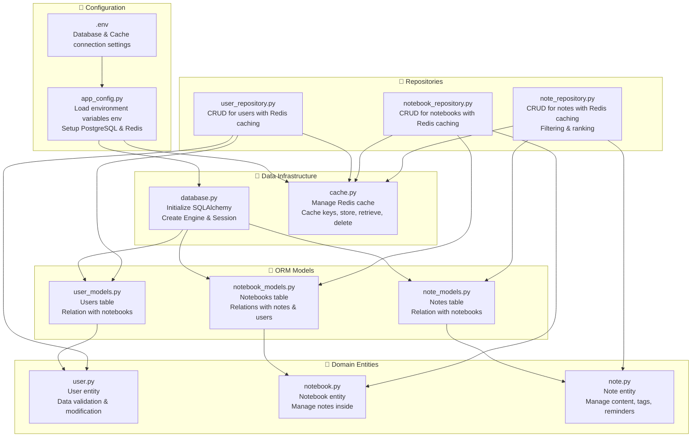

```mermaid
flowchart TD
    subgraph Config[📂 Configuration]
        A1[app_config.py<br>Load environment variables env<br>Setup PostgreSQL & Redis]
        A2[.env<br>Database & Cache connection settings]
    end

    subgraph DB[📂 Data Infrastructure]
        B1[database.py<br>Initialize SQLAlchemy<br>Create Engine & Session]
        B2[cache.py<br>Manage Redis cache<br>Cache keys, store, retrieve, delete]
    end

    subgraph Models[📂 ORM Models]
        C1[user_models.py<br>Users table<br>Relation with notebooks]
        C2[notebook_models.py<br>Notebooks table<br>Relations with notes & users]
        C3[note_models.py<br>Notes table<br>Relation with notebooks]
    end

    subgraph Entities[📂 Domain Entities]
        D1[user.py<br>User entity<br>Data validation & modification]
        D2[notebook.py<br>Notebook entity<br>Manage notes inside]
        D3[note.py<br>Note entity<br>Manage content, tags, reminders]
    end

    subgraph Repos[📂 Repositories]
        E1[user_repository.py<br>CRUD for users with Redis caching]
        E2[notebook_repository.py<br>CRUD for notebooks with Redis caching]
        E3[note_repository.py<br>CRUD for notes with Redis caching<br>Filtering & ranking]
    end

    %% Relations
    A1 --> B1
    A1 --> B2
    A2 --> A1

    B1 --> C1
    B1 --> C2
    B1 --> C3

    C1 --> D1
    C2 --> D2
    C3 --> D3

    E1 --> C1
    E2 --> C2
    E3 --> C3

    E1 --> D1
    E2 --> D2
    E3 --> D3

    E1 --> B2
    E2 --> B2
    E3 --> B2
```