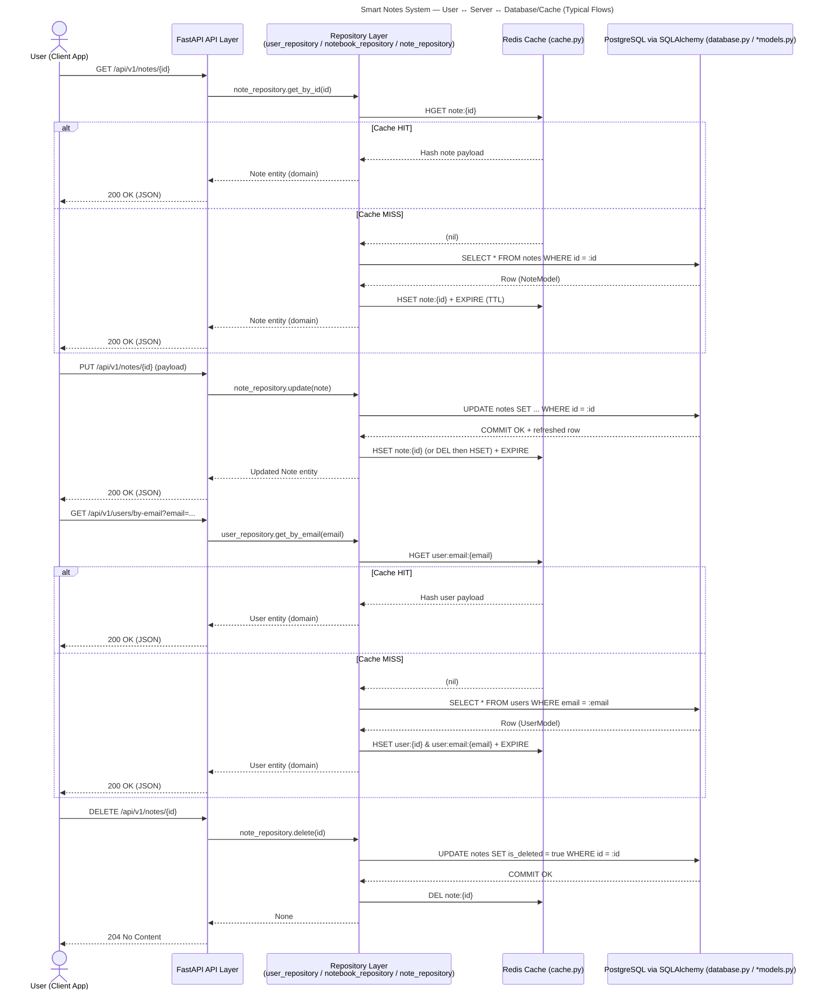

```mermaid

sequenceDiagram
    title Smart Notes System — User ↔ Server ↔ Database/Cache (Typical Flows)

    actor U as User (Client App)
    participant API as FastAPI API Layer
    participant Repo as Repository Layer<br/>(user_repository / notebook_repository / note_repository)
    participant Cache as Redis Cache (cache.py)
    participant DB as PostgreSQL via SQLAlchemy (database.py / *models.py)

    %% ---------- READ: Get Note by ID (read-through cache) ----------
    U->>API: GET /api/v1/notes/{id}
    API->>Repo: note_repository.get_by_id(id)
    Repo->>Cache: HGET note:{id}
    alt Cache HIT
        Cache-->>Repo: Hash note payload
        Repo-->>API: Note entity (domain)
        API-->>U: 200 OK (JSON)
    else Cache MISS
        Cache-->>Repo: (nil)
        Repo->>DB: SELECT * FROM notes WHERE id = :id
        DB-->>Repo: Row (NoteModel)
        Repo->>Cache: HSET note:{id} + EXPIRE (TTL)
        Repo-->>API: Note entity (domain)
        API-->>U: 200 OK (JSON)
    end

    %% ---------- WRITE: Update Note (commit → cache refresh) ----------
    U->>API: PUT /api/v1/notes/{id} (payload)
    API->>Repo: note_repository.update(note)
    Repo->>DB: UPDATE notes SET ... WHERE id = :id
    DB-->>Repo: COMMIT OK + refreshed row
    Repo->>Cache: HSET note:{id} (or DEL then HSET) + EXPIRE
    Repo-->>API: Updated Note entity
    API-->>U: 200 OK (JSON)

    %% ---------- EXAMPLE: Get User by Email (read-through cache) ----------
    U->>API: GET /api/v1/users/by-email?email=...
    API->>Repo: user_repository.get_by_email(email)
    Repo->>Cache: HGET user:email:{email}
    alt Cache HIT
        Cache-->>Repo: Hash user payload
        Repo-->>API: User entity (domain)
        API-->>U: 200 OK (JSON)
    else Cache MISS
        Cache-->>Repo: (nil)
        Repo->>DB: SELECT * FROM users WHERE email = :email
        DB-->>Repo: Row (UserModel)
        Repo->>Cache: HSET user:{id} & user:email:{email} + EXPIRE
        Repo-->>API: User entity (domain)
        API-->>U: 200 OK (JSON)
    end

    %% ---------- DELETE: Soft delete Note (invalidate cache) ----------
    U->>API: DELETE /api/v1/notes/{id}
    API->>Repo: note_repository.delete(id)
    Repo->>DB: UPDATE notes SET is_deleted = true WHERE id = :id
    DB-->>Repo: COMMIT OK
    Repo->>Cache: DEL note:{id}
    Repo-->>API: None
    API-->>U: 204 No Content
```

