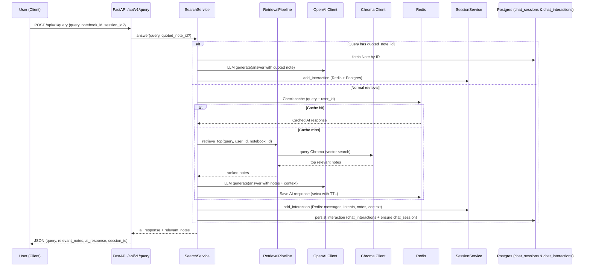

```mermaid

sequenceDiagram
    participant U as User (Client)
    participant API as FastAPI /api/v1/query
    participant SS as SearchService
    participant RS as RetrievalPipeline
    participant OC as OpenAI Client
    participant CC as Chroma Client
    participant R as Redis
    participant Sess as SessionService
    participant PG as Postgres (chat_sessions & chat_interactions)

    U->>API: POST /api/v1/query {query, notebook_id, session_id?}
    API->>SS: answer(query, quoted_note_id?)
    
    alt Query has quoted_note_id
        SS->>PG: fetch Note by ID
        SS->>OC: LLM generate(answer with quoted note)
        SS->>Sess: add_interaction (Redis + Postgres)
    else Normal retrieval
        SS->>R: Check cache (query + user_id)
        alt Cache hit
            R-->>SS: Cached AI response
        else Cache miss
            SS->>RS: retrieve_top(query, user_id, notebook_id)
            RS->>CC: query Chroma (vector search)
            CC-->>RS: top relevant notes
            RS-->>SS: ranked notes
            SS->>OC: LLM generate(answer with notes + context)
            SS->>R: Save AI response (setex with TTL)
        end
        SS->>Sess: add_interaction (Redis: messages, intents, notes, context)
        SS->>PG: persist interaction (chat_interactions + ensure chat_session)
    end
    
    SS-->>API: ai_response + relevant_notes
    API-->>U: JSON {query, relevant_notes, ai_response, session_id}

```